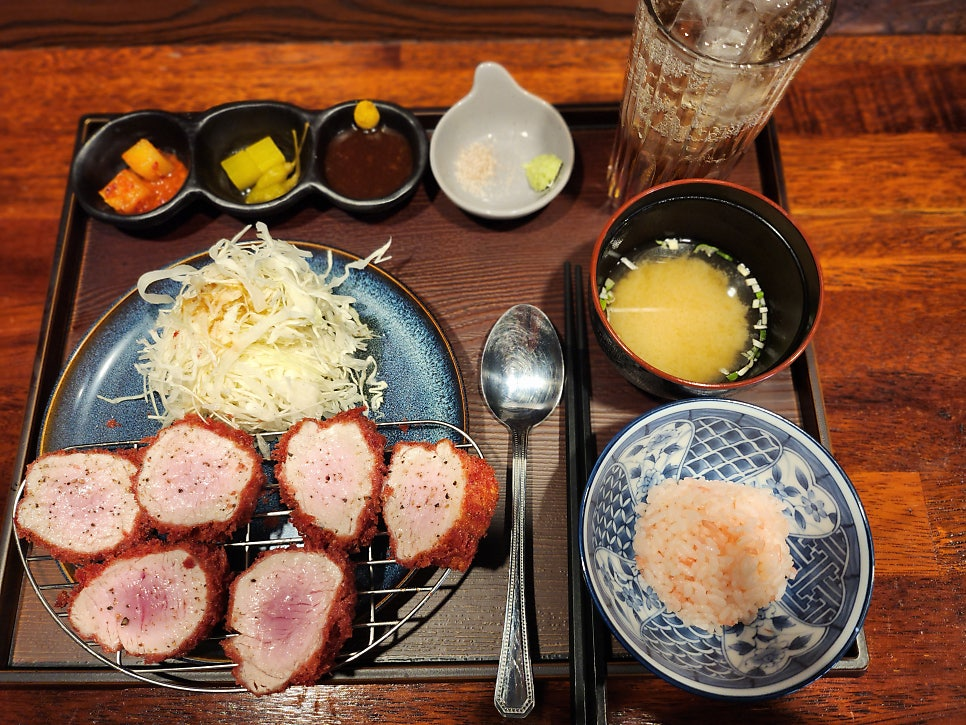

# 🍽️ 경북대학교 북문 맛집 가이드

> 경북대학교 북문에서 실제 방문 후 추천하는 맛집 5곳 정리  
> 학생들이 자주 찾는 가성비 식당부터 술집까지 다양한 음식점을 소개합니다.

---

## 📑 목차

- [소개](#소개)
- [도톤](#1-도톤)
- [천계안동찜닭](#2-천계안동찜닭)
- [돈가스반상](#3-돈가스반상)
- [가향미 마라탕](#4-가향미-마라탕)
- [사군자민속촌](#5-사군자민속촌)
- [정리](#정리)

---

## 소개

경북대학교 북문은 대학가 특유의 활기와 다양한 음식점들이 모여 있는 대표적인 상권이다. 학생들이 자주 찾는 식당들이 밀집해 있어 식사, 모임, 간단한 술자리까지 다양한 목적에 맞게 방문할 수 있다.  

작성자는 농대 출신으로 북문 주변 식당을 자주 방문했으며, 실제로 여러 번 방문해보고 만족했던 식당들을 중심으로 소개하고자 한다. 특히 학생들이 부담 없이 방문할 수 있는 가격대와 음식의 맛, 그리고 분위기를 기준으로 선별하였다.  

돈카츠 전문점, 찜닭 전문점, 마라탕 식당, 전통 주점 등 다양한 음식 종류를 포함하여 상황에 따라 선택할 수 있는 맛집들을 정리하였다.

---

# 1. 도톤

| 정보 | 내용 |
|-----|-----|
| 음식 종류 | 일식 돈카츠 |
| 위치 | 경북대학교 북문 먹자골목 / 대학로23길 18-3 |
| 영업시간 | 11:15 ~ 20:00 |
| 브레이크타임 | 14:15 ~ 17:00 |
| 휴무 | 일요일 |

### ⭐ 인기 메뉴
- 흑돼지 안심 돈카츠  
- 흑돼지 등심 돈카츠  

### 💰 가격대
1만 ~ 2만원

### 🍽 음식 평가

홍국쌀이 들어간 빨간 튀김옷 돈카츠로 유명한 식당이다. 겉은 바삭하고 속은 촉촉한 식감이 특징이며 흑돼지를 사용해 육즙이 풍부하다.  

누룩 소금 숙성으로 육질이 부드럽고 풍미가 깊다. 또한 사사미 카츠나 블랙 타이거 새우 등심카츠 같은 특별한 메뉴도 있어 다양한 돈카츠를 즐길 수 있다. 밥이 무한리필이라 학생들에게 만족도가 높은 식당이다.

---

# 2. 천계안동찜닭

| 정보 | 내용 |
|-----|-----|
| 음식 종류 | 찜닭 |
| 위치 | 경북대 어린이집 건너 골목 / 대학로13길 3-2 |
| 영업시간 | 11:00 ~ 21:00 |
| 라스트오더 | 20:30 |
| 휴무 | 매달 첫 번째 일요일 |

### ⭐ 인기 메뉴
- 천계 안동찜닭  
- 묵은지 찜닭  

### 💰 가격대
1만 ~ 2만원

### 🍽 음식 평가

안동찜닭 특유의 짭짤하고 달콤한 간장 양념이 특징이다. 마늘 향이 어우러져 깊은 풍미를 느낄 수 있으며 당면과 함께 먹으면 더욱 맛있다.  

양이 넉넉해 친구들과 함께 식사하기 좋고 가성비가 좋은 식당이다. 또한 계란을 직접 구워 먹을 수 있어 재미있는 요소가 있으며 1인 가구를 위한 배달용 나홀로 찜닭 메뉴도 제공한다.

---

# 3. 돈가스반상

| 정보 | 내용 |
|-----|-----|
| 음식 종류 | 돈카츠 |
| 위치 | 경북대학교 북문 먹자골목 / 대학로23길 13-1 |
| 영업시간 | 11:00 ~ 20:30 |
| 브레이크타임 | 15:00 ~ 17:00 |
| 휴무 | 토요일, 일요일 |

### ⭐ 인기 메뉴
- 치즈 돈가스 정식  
- 안심 돈가스 정식  

### 💰 가격대
8천원 ~ 1만원

### 🍽 음식 평가

가성비가 뛰어난 돈카츠 정식집으로 학생들에게 인기가 많은 식당이다. 돈가스 정식을 주문하면 돈가스와 함께 밥과 국수가 제공되어 든든하게 식사할 수 있다.  

국수는 냉국수, 비빔국수, 온국수 중 선택할 수 있으며 어떤 메뉴를 선택해도 돈가스와 잘 어울린다.

---

# 4. 가향미 마라탕

| 정보 | 내용 |
|-----|-----|
| 음식 종류 | 마라탕 |
| 위치 | 경북대학교 북문 먹자골목 / 대학로23길 34 |
| 영업시간 | 11:00 ~ 23:00 |
| 휴무 | 토요일 |

### ⭐ 인기 메뉴
- 마라탕  
- 마라샹궈  

### 💰 가격대
8천원 ~ 2만원

### 🍽 음식 평가

내 기준 북문 주변의 많은 마라탕 식당 중에서도 특히 맛이 좋다고 평가하는 곳이다. 땅콩 향의 고소함과 고추기름의 매콤함, 마유의 얼얼함이 어우러져 깊은 풍미를 만든다.  

밥이 무한리필이라 든든하게 식사를 할 수 있으며 밑반찬으로 제공되는 짜사이도 음식과 잘 어울린다.

---

# 5. 사군자민속촌

| 정보 | 내용 |
|-----|-----|
| 음식 종류 | 한식 주점 |
| 위치 | 경북대 어린이집 건너 골목 / 대학로13길 3-35 |
| 영업시간 | 16:00 ~ 01:00 |

### ⭐ 인기 메뉴
- 낙지볶음  
- 해물왕파전  
- 녹두빈대떡  
- 오징어무침회  
- 꿀막걸리  

### 💰 가격대
2만원대

### 🍽 음식 평가

전통적인 분위기의 민속주점으로 친구들과의 모임이나 술자리에 적합한 장소이다. 편안하고 정겨운 노포 분위기가 특징이며 다양한 전통 안주를 즐길 수 있다.  

특히 해물파전이나 녹두빈대떡, 낚지볶음 등의 메뉴평이 좋으며 꿀막걸리는 달콤하고 부드러운 맛으로 많은 학생들이 즐겨 찾는다.

---

## 정리

경북대학교 북문은 다양한 음식점이 밀집된 대학가 상권으로 학생들의 취향과 예산을 모두 만족시킬 수 있는 장소이다.  

돈카츠, 찜닭, 마라탕, 전통주점까지 다양한 음식 선택지가 있어 상황에 따라 식사나 모임을 즐길 수 있다. 위에서 소개한 다섯 곳은 특히 학생들 사이에서 꾸준히 사랑받는 맛집으로 처음 방문하는 사람들에게도 추천할 만한 식당들이다.
